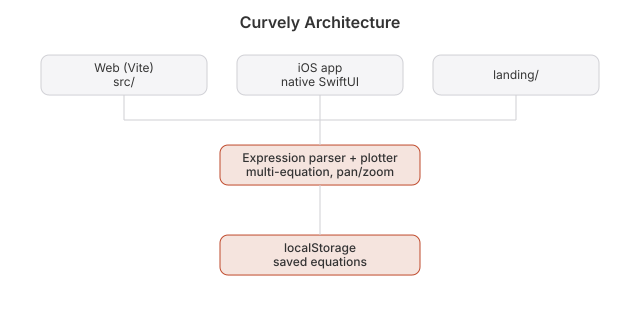

# Curvely

 

**Live:** https://curvely.heyitsmejosh.com

A graphing calculator that feels like it belongs on your phone.

Type an equation and watch it draw. Add another. Pinch, pan, zoom. Native SwiftUI on
iPhone, iPad and Mac with Apple's Liquid Glass look, and the same thing on the web.

An Apple Watch companion (`watchos/`) pages through a handful of preset curves — `x^2`,
`sin(x)`, `cos(x)`, and others — rendered by the same hand-written expression parser and
evaluator the iOS app uses (`ios/App/Expression.swift`, mirrored into `watchos/Models/`).
There's no equation input on the watch (no practical keyboard for `sin(x)` at 40mm) and no
backend to sync against — Curvely's math is fully client-side on every platform — so this
is a standalone `WKWatchOnly` app, not a paired companion with a pairing/sync screen.

## Roadmap

- [ ] Pass over equation input: error states, edge-case parsing
- [x] (2026-09-02: both palettes wrap, web now also handles negative/NaN) Restored equations lose their colour (grey dot) when the saved colorIndex
      falls outside the palette

## Whitepaper

[Technical whitepaper](WHITEPAPER.md)

## API and agent tools

An agent can drive this app. [`docs/API.md`](docs/API.md) lists the HTTP surface, where there
is one, and the WebMCP tools registered on `document.modelContext`. Tools come in three kinds:
read-only, writes you can undo, and the few that ask a human first.

## Architecture

